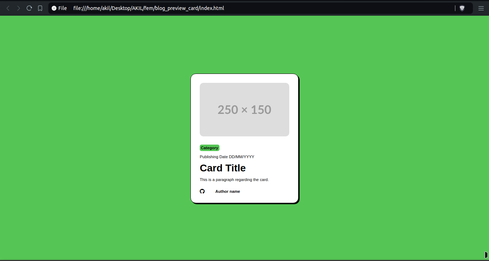

# Frontend Mentor - Blog preview card solution

This is a solution to the [Blog preview card challenge on Frontend Mentor](https://www.frontendmentor.io/challenges/blog-preview-card-ckPaj01IcS).

## Table of contents

- [Overview](#overview)
  - [The challenge](#the-challenge)
  - [Screenshot](#screenshot)
  - [Links](#links)
- [My process](#my-process)
  - [Built with](#built-with)
  - [What I learned](#what-i-learned)
  - [Useful resources](#useful-resources)
- [Author](#author)

## Overview

### The challenge

Users should be able to:

- See hover and focus states for all interactive elements on the page

### Screenshot



### Links

- Solution URL: [https://github.com/akil4/blog_preview_card](https://github.com/akil4/blog_preview_card)
- Live Site URL: [https://akil4.github.io/blog_preview_card/](https://akil4.github.io/blog_preview_card/)

## My process

### Built with

- Semantic HTML5 markup
- CSS custom properties
- Flexbox

### What I learned

Use this section to recap over some of your major learnings while working through this project. Writing these out and providing code samples of areas you want to highlight is a great way to reinforce your own knowledge.

To see how you can add code snippets, see below:

```html
<h1>Some HTML code I'm proud of</h1>
```
```css
.proud-of-this-css {
  color: papayawhip;
}
```
```js
const proudOfThisFunc = () => {
  console.log('🎉')
}
```

### Useful resources

- [Font Awesome](https://fontawesome.com/) - This provided me with the logo that I used in place of the author's picture.
- [Placehold Co](https://placehold.co/) - This provided me with the placeholder image for my article.

## Author

- GitHub - [akil4](https://github.com/akil4)
- Frontend Mentor - [@akil4](https://www.frontendmentor.io/profile/akil4)
